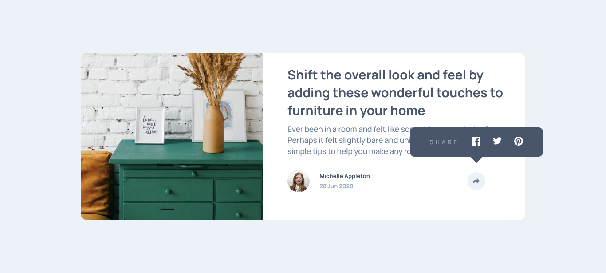

# Frontend Mentor - Article preview component

# Frontend Mentor - Article preview component solution

This is a solution to the [Article preview component challenge on Frontend Mentor](https://www.frontendmentor.io/challenges/article-preview-component-dYBN_pYFT). Frontend Mentor challenges help you improve your coding skills by building realistic projects.

## Table of contents

- [Overview](#overview)
  - [The challenge](#the-challenge)
  - [Screenshot](#screenshot)
  - [Links](#links)
- [My process](#my-process)
  - [Built with](#built-with)
  - [Useful resources](#useful-resources)
- [Author](#author)
- [Acknowledgments](#acknowledgments)

**Note: Delete this note and update the table of contents based on what sections you keep.**

## Overview

### The challenge

Users should be able to:

- View the optimal layout for the component depending on their device's screen size
- See the social media share links when they click the share icon

### Screenshot

### Links

- Solution URL: [Solution](https://github.com/Nabil19911/Frontend-Mento-Article-preview-component-solution)
- Live Site URL: [Live site](https://nabil19911.github.io/Frontend-Mento-Article-preview-component-solution/)

## My process

### Built with

- Semantic HTML5 markup
- CSS custom properties
- Flexbox
- CSS Grid
- Desktop-first workflow

### Useful resources

- [W3school](https://www.w3school.com)
- [Devdocs](https://www.devdocs.io)

## Author

- Frontend Mentor - [@nabil19911](https://www.frontendmentor.io/profile/nabil19911)

## Acknowledgments

I thank myself for doing things for my pleasure and future.
